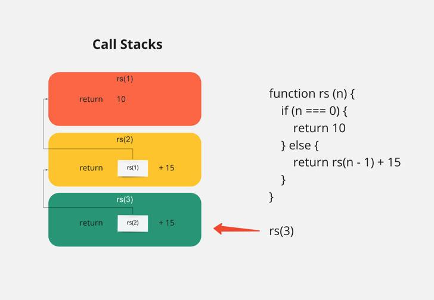

## 什麼是 Recursion?

Recursion 譯作 `遞迴`，是一種很重要且常見的演算法，之後學習排列(sort) 演算法時，會大量使用。
遞迴的函數包含以下特性：

1. 遞迴函數會自己執行自己
2. 遞歸函數使用一種資料結構，叫做 `stack`，翻譯為 `堆疊`。當我們呼叫的函數，呼叫了另一個函數，這時就正在經歷在一個 `call stack` 的過程
3. 不僅是一種演算法，在數學中，遞迴函數之間是一種 Sequences (數列) 的關係

## Recursion 的概念

用數學中的`遞迴數列`來解釋，假設一數列 T 的定義是。

```txt
T(1) = 10
T(n) = T(n - 1) + 15
```

在 `T` 這個數列中的第一項，被定義為 `10`；

在 `T` 這個數列的第 n 項，被定義為 `T(n) 數列的前一項，再加上 15`

這個 T 數列成員會是：

```txt
T(1) = 10
T(2) = T(2 - 1) + 15 -> 10 + 15 = 25
T(3) = T(3 - 1) + 15 -> 25 + 15 = 40
T(4) = T(4 - 1) + 15 -> 40 + 15 = 55
=======================
The T Sequence -> 10, 25, 40, 55 ...
```

使用 JS 實作一個遞迴函數，模擬該數列

```js
function recursionSequence(n) {
  if (n === 1) {
    return 10
  } else {
    return recursionSequence(n - 1) + 15
  }
}

recursionSequence(3) // 40
```

流程：



雖然我們表面上只執行了一次 `rs(3)`，但因為遞迴呼叫的關係，rs 函數被執行了三次，依時間先後執行順序為 `rs(3) -> rs(2) -> rs(1)`。

## 例子 - Fibonacci Sequence 費波那契數列

目標：Write a function that takes an integer `N` as an input and returns the Nth number in Fibonacci Sequence

**Fibonacci Sequence is defined by：**

```txt
F(0) = 0
F(1) = 1
F(n) = F(n - 1) + F(n - 2)
```

**實作：**

```js
function fs(n) {
  if (n === 0) {
    return 0
  } else if (n === 1) {
    return 1
  } else {
    return fs(n - 1) + fs(n - 2)
  }
}
```

執行

```js
for (let i = 0; i <= 10; i++) {
  const res = fs(i)
  console.log(`F(${i}) returns ${res}`)
}

/* 
  F(0) returns 0
  F(1) returns 1
  F(2) returns 1
  F(3) returns 2
  F(4) returns 3
  F(5) returns 5
  F(6) returns 8
  F(7) returns 13
  F(8) returns 21
  F(9) returns 34
  F(10) returns 55 
*/
```

## Coding Practice

現在來用剛學到的概念來試著解題吧。

### 1. Array of Arrays

寫一個函數 collector，接收一個巢狀 arrs，回傳一個 array，裡面包含 arrs 所有巢狀陣列內的值。

```js
let arrs = [[[['a', [['b', ['c']], ['d']]], [['e']], [[['f', 'g', 'h']]]]]]

collector(arrs) // ['a', 'b', 'c', 'd', 'e', 'f', 'g', 'h']
```

> [Array of Arrays 解答](https://github.com/dylan237/algorithms-data-structures-notes/blob/master/02_algorithm-design/07_recursion/1_array-of-arrays.js)

## Reference

[資料結構與演算法 (JavaScript) - 38. Fibonacci Sequence](https://www.udemy.com/course/algorithm-data-structure/learn/lecture/25139512#questions)

[資料結構與演算法 (JavaScript) - 39. Array of Arrays](https://www.udemy.com/course/algorithm-data-structure/learn/lecture/25139570#questions)
