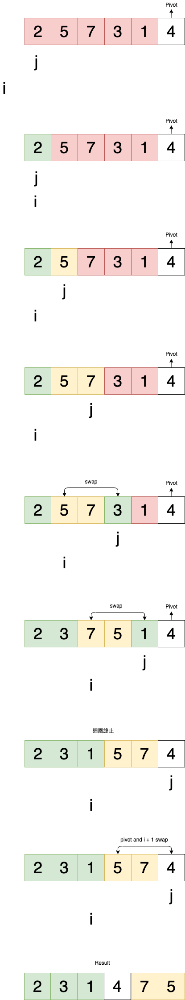

## Quick Sort 的概念

- 如同它的名字一樣，是一個快速高效率的排序演算法
- 由英國電腦科學家 Tony Hoare 於 1959 年發明，並於 1961 年發表。至今為止還是一個應用非常廣泛的排序演算法
- 和 [Merge Sort](https://github.com/dylan237/algorithms/blob/master/04_sorting-algorithms-II/01_merge-sort/README.md) 一樣，使用了 `Divide and Conquer` 概念
- Quick Sort 使用了一種叫做 `Partition` 的演算法，因此在學習 Qucik Sort 以前，有必要先理解 Partition。另外 Partition 這個詞是由英文 Part 衍伸而來的，有「某一個部分」和 「劃分」的意思

## Partition

- Partition 本身不是一種排序演算法，但它是 Quick Sort 邏輯中重要的子程式( subroutine )
- Partition 的思想是取陣列中的最後一個元素做`基準值 (Pivot)`，接著將除了 Pivot 以外的元素，分成兩個陣列，其中一邊內的元素都會比 Pivot 小，另一邊則相反，最後將 Pivot 插入兩個陣列之間。這麼做的目的只有一個，就是將 Pivot 元素排列到正確的位置。

**視覺化流程**

以陣列最後一個元素作為 Pivot


從陣列第一個元素開始與 Pivot 比較大小，進行分類


同類型的 Partition 元素必須是相連的，在找到了新的 Less than pivot partition 時 (綠色部分)，要將他與 Greater than pivot partition (紅色部分) 的第一個元素交換位置


一樣的情況重複上述步驟


分類完成後，Pivot 需要與 Greater than pivot partition 的第一個元素交換位置


完成


**實作**

```js
const arr = [2, 5, 7, 3, 1, 4]

function partition(start, end) {
  let pivot = arr[end] // 最後一個元素
  let i = start - 1 // 紀錄 less than pivot partition 的最後一個索引位置

  // 遍歷 pivot 以外全部元素
  for (let j = start; j < end; j++) {
    if (arr[j] <= pivot) {
      i += 1
      ;[arr[i], arr[j]] = [arr[j], arr[i]]
    }
  }

  // 將 pivot 插入兩個 partitions 中間
  ;[arr[i + 1], arr[end]] = [arr[end], arr[i + 1]]

  // 回傳 pivot 最後位置的索引
  return i + 1
}

partition(0, 5) // output: 3, arr: [2, 3, 1, 4, 7, 5]
```

**程式碼流程**



## 實作 Quick Sort

```js
const arr = [2, 5, 7, 3, 1, 4]
quickSort(0, arr.length - 1)

function partition(start, end) {
  let pivot = arr[end]
  let i = start - 1

  for (let j = start; j < end; j++) {
    if (arr[j] <= pivot) {
      i += 1
      ;[arr[i], arr[j]] = [arr[j], arr[i]]
    }
  }
  ;[arr[i + 1], arr[end]] = [arr[end], arr[i + 1]]
  return i + 1
}

function quickSort(start, end) {
  if (start < end) {
    const q = partition(start, end)
    quickSort(start, q - 1)
    quickSort(q + 1, end)
  }
}
```

## Quick Sort 的 Big O Notation

Worst Case Performance: `O(n^2)`

Best Case Performance: `O(n logn)`

Average Case Performance: `O(n logn)`

## Reference

- [資料結構與演算法 (JavaScript) - 62. Quick Sort and Partition](https://www.udemy.com/course/algorithm-data-structure/learn/lecture/25271254)

- [資料結構與演算法 (JavaScript) - 63. Implementing Quick Sort](https://www.udemy.com/course/algorithm-data-structure/learn/lecture/25271310)

- [資料結構與演算法 (JavaScript) - 63. Overview of Quick Sort](https://www.udemy.com/course/algorithm-data-structure/learn/lecture/25271492)
