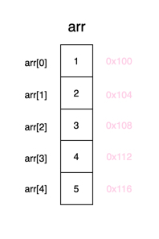
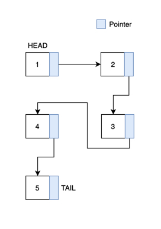
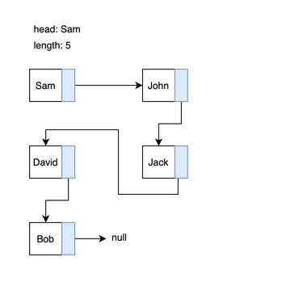
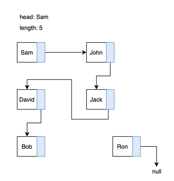
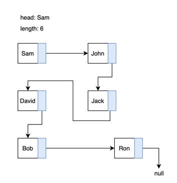
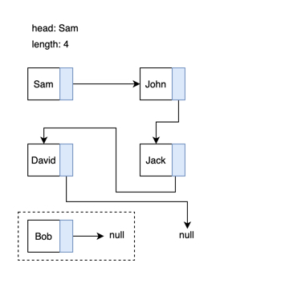
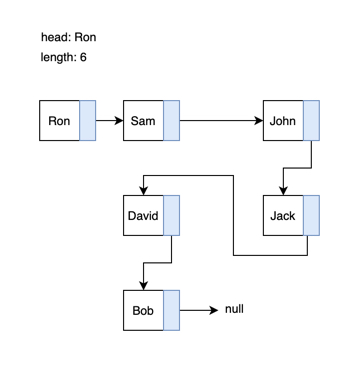
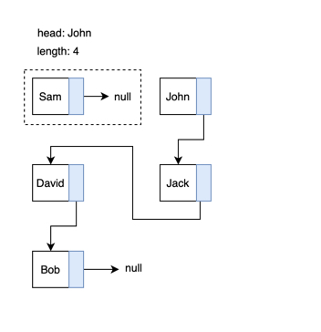

## Linked List 的概念

Linked List 與 Array 很類似，常常被拿來做對比，不過當中有些差異：

- 記憶體位址： Linked List 是一種 `線性的集合 Linear Collection`，是動態的資料結構，相對於 Array ，`不需連續的記憶體空間`即可儲存。
- 資料長度限制： 資料長度不受限制；Array 則是長度固定，「通常」不可動態擴展。
- 增刪效率高： 對於資料的 insertion 和 deletion 成本較 Array 低，只需改變其中一個節點的指向，不影響其他節點。
- 查詢效率低： access 其中某一節點上的資料，則必須從頭開始遍歷查找，成本較 Array 高。

### 基本資料型態

- Linked List 資料結構包含兩個 property， `head` 和 `length`，分別代表第一個元素及元素的數量。
- 每個元素都是一個 `節點 (node)`，每個 node 包含兩個 property，`value` 和 `next`，value 可以是任何型別的資料，next 則是指向下一個 node，若是最後一 node 則 next 指向 null。

### 記憶體位址

**Array：**

Array 中元素的儲存是按照先後順序進行的，同時在記憶體中也是按照這個順序進行連續存放。陣列相鄰元素之間的記憶體地址的間隔一般就是陣列資料型別的大小。

另外，通常陣列在宣告時必須指定其長度，通常無法動態擴增。以 Java 為例，在宣告一個 Array 時，必須要宣告這個 Array 的 size 是多少，同時從記憶體中分割一塊連續的數個空間，分配給這個 Array 使用。

在 Java 中宣告一個長度為 5 的陣列：

```java
int[] myArr = new int[5];
```

示意圖：



順帶一提，在 JavaScript 中不需要事先設定陣列 size，這是語言設計的差異。在 JS 中，當你的 Array 內部元素不斷在增加的時候，JS 會進行 `Space Doubling`，自動增加分配給這個 Array 的記憶體空間。

舉例來說：

```js
const myArr = [] // size: 1
```

當宣告一個空陣列時，JS 會分配給他一個記憶體空間，相當於 JS 當作這個陣列預設的 size 為 1

```js
myArr.push('A')
myArr.push('B')
```

當進行 insertion 後，且元素的數量超過預設 size 時，JS 會自動再切割`一倍`的記憶體空間給 myArr，這個行為就稱為 `Space Doubling`，此時的 myArr 分配到的記憶體空間被擴充到了 `2`，以此類推。

**Linked List：**

Linked List 相較於 Array，除了資料，還增加了指標 ( pointer ) 用於構建鏈式的儲存資料。Linked List 中每一個節點都包含此節點的資料( value ) 和指向下一節點地址的指標( pointer/next )。由於是通過指標進行下一個資料元素的查詢和訪問，使它的自由度更高。

這表現在對節點進行增加和刪除時，只需要對上一節點的指標地址進行修改，而無需變動其它的節點。不過事物皆有兩極，指標帶來高自由度的同時，自然會犧牲資料查詢的效率和多餘記憶體空間的使用。



## Methods of Linked List

和 Array 一樣，Linked List 也有自己的新增刪除方法，像是 `push`、`pop`、`shift`、`unshift`..等，接下來用圖片的方式來理解，在 Linked List 中這些方法的流程邏輯。

### push - 插入節點到最後

原始資料



新增一個 Node，在記憶體的某個位置



將 Linked List 最後一筆資料的 `next` 指向新的 Node，並且將 Linked List 的 length +1



### pop - 刪除最後一個節點

原始資料


將倒數第二筆資料指向 null，使最後一個 node 與 Linked List 失去連結，排除在 List 以外，並且將 length -1



### unshift - 插入節點到最前

原始資料


新增 Node 將它的 next 指向 Linked List 第一筆資料，修改 Linked List 的 head 為新增的 node，最後 length +1


### shift - 刪除第一個節點

原始資料


將第一個 Node 的 next 指向 null，使它與 List 斷開串連，並將 Linked List 的 head 改為指向原來的第二個 Node，最後 length -1



## 實作

透過上面學到的概念，來試著把 Linked List 用 JavaScript 實作出來，實作分為兩個 部分，`Node` 與 `Linked List`。

### Node

複習一下上面提到的[概念](https://github.com/dylan237/algorithms/blob/master/05_data-structure/01_linked-list/README.md#linked-list-%E7%9A%84%E6%A6%82%E5%BF%B5)，Linked List 內的每個元素都是一個節點 (Node)，而每個節點內有兩個 property，分別是 `value` 及 `next`，value 可以是任何型別的值，next 則指向下一個節點。

```js
class Node {
  constructor(value) {
    this.value = value
    this.next = null
  }
}
```

### Linked List

開頭的[概念](<[概念](https://github.com/dylan237/algorithms/blob/master/05_data-structure/01_linked-list/README.md#linked-list-%E7%9A%84%E6%A6%82%E5%BF%B5)>)部分也提到了，Linked List 包含兩個 property，分別是 `head` 和 `length`，前者代表 List 的第一個元素，另一個代表 List 內有幾個節點。

```js
class LinkedList {
  constructor() {
    this.head = null
    this.length = 0
  }
}
```

### Methods of Linked List

透過[圖解 Methods of Linked List](https://github.com/dylan237/algorithms/blob/master/05_data-structure/01_linked-list/README.md#methods-of-linked-list)段落，我們已經大致了解 Linked List 資料結構的新增刪除有哪些基本功能了，接著透過程式碼一個個實作出來吧。

#### push - 插入節點到最後

push 分為兩種狀況，一個是 Linked List 是空的，另一個是有節點。空的情況很單純，只需要將新節點寫入 head 就可以了。當 List 有值時，就需要從 head 開始往後查詢，直到找到 next 為 null
的節點，即是 List 的最後一個節點，這時將新節點寫入它的 next 即可。

```js
class LinkedList {
  constructor() {
    this.head = null
    this.length = 0
  }

  push(value) {
    if (value === undefined) return

    const newNode = new Node(value)

    if (!this.head) {
      this.head = newNode
    } else {
      let currentNode = this.head
      while (currentNode.next !== null) {
        currentNode = currentNode.next
      }
      currentNode.next = newNode
    }

    this.length += 1
  }
}
```

#### pop - 刪除最後一個節點

找到倒數第二個節點，並且將 next 值改為 null。透過迴圈跑 `length - 2` 次，即可找到倒數第二個節點的位置。

```js
class LinkedList {
  constructor() {
    this.head = null
    this.length = 0
  }

  pop() {
    if (!this.head) return null
    if (this.length === 1) {
      const cache = this.head
      this.head = null
      this.length = 0
      return cache
    } else {
      let currentNode = this.head
      for (let i = 0; i < this.length - 2; i++) {
        currentNode = currentNode.next
      }
      const cache = currentNode.next
      currentNode.next = null
      this.length -= 1
      return cache
    }
  }
}
```

#### unshift - 插入節點到最前

將新節點的 next 指向當前的 head 節點，並將 head 改為新節點。

```js
class LinkedList {
  constructor() {
    this.head = null
    this.length = 0
  }

  unshift(value) {
    if (value === undefined) return

    const newNode = new Node(value)

    if (!this.head) {
      this.head = newNode
    } else {
      const oldHead = this.head
      this.head = newNode
      this.head.next = oldHead
    }
    this.length += 1
  }
}
```

#### shift - 刪除第一個節點

把 head 值改成 head.next 即完成。

```js
class LinkedList {
  constructor() {
    this.head = null
    this.length = 0
  }

  shift() {
    if (!this.head) return null
    const cache = this.head

    if (this.length === 1) {
      this.head = null
    } else {
      this.head = this.head.next
    }
    this.length -= 1
    return cache
  }
}
```

#### get - 傳入索引取得對應 Node

由於 Linked List 沒有真正意義上的索引，要取得特定資料只能從頭開始遍歷。
從這個方法實作可以很清楚的看到，在訪問資料方面 Linked List 的時間複雜度要差於陣列。

```js
class LinkedList {
  constructor() {
    this.head = null
    this.length = 0
  }

  get(index) {
    if (typeof index !== 'number' || index < 0 || index > this.length - 1) {
      return null
    }

    let currentNode = this.head

    for (let i = 0; i < index; i++) {
      currentNode = currentNode.next
    }

    return currentNode.value
  }
}
```

#### forEach - 遍歷所有 Node

```js
class LinkedList {
  constructor() {
    this.head = null
    this.length = 0
  }

  forEach(cb) {
    let currentNode = this.head

    for (let i = 0; i < this.length; i++) {
      cb(currentNode, i)

      if (currentNode.next) {
        currentNode = currentNode.next
      }
    }
  }
}
```

#### insertAt - 插入節點至指定索引位置

```js
class LinkedList {
  constructor() {
    this.head = null
    this.length = 0
  }

  insertAt(index, value) {
    if (
      index < 0 ||
      index > this.length ||
      typeof index !== 'number' ||
      value === undefined
    ) {
      return null
    }

    if (this.head === null || index === this.length) {
      this.push(value)
    } else if (index === 0) {
      this.unshift(value)
    } else {
      const newNode = new Node(value)

      this.forEach((currentNode, currentIndex) => {
        if (currentIndex === index - 1) {
          newNode.next = currentNode.next
          currentNode.next = newNode
        }
      })

      this.length += 1
    }
  }
}
```

#### removeAt - 刪除指定索引節點

```js
class LinkedList {
  constructor() {
    this.head = null
    this.length = 0
  }

  removeAt(index) {
    if (
      this.length === 0 ||
      index < 0 ||
      index > this.length - 1 ||
      typeof index !== 'number'
    ) {
      return null
    }

    if (index === 0) {
      return this.shift()
    } else if (index === this.length - 1) {
      return this.pop()
    } else {
      let cache = null

      this.forEach((currentNode, currentIndex) => {
        if (currentIndex === index - 1) {
          cache = currentNode.next
          currentNode.next = currentNode.next.next
        }
      })
      this.length -= 1

      return cache
    }
  }
}
```

[Linked List 完整程式碼](https://github.com/dylan237/algorithms/blob/master/05_data-structure/01_linked-list/linked-list-implement.js)

## Doubly Linked List

## Linked List 優缺點

看到這裡，也對 Linked List 有一定程度的認識了，接著來總結一下它的優缺點。

**優點**

1. 可以無限將 Elements 插入 (insert to) Linked List 中，只需要修改 node 的指向即可。而 Array 初始化時就已經限制了 Elements 的數量 (size) 了，分割出的固定記憶體空間被填滿後，還需要在做空間 resize，相比之下較有優勢。

2. 相比於 Array，`插入 (insertion)` 及 `刪除 (deletion)` 快非常多，可以有效降低時間複雜度。

**缺點**

1. 和 Array 相比，需要用到更多的`記憶體空間`，主因是 Linked List 用了 pointer (next property) 指向下一個 Node，進行資料的串連。

2. 訪問(access) Linked List 內的元素比 Array 效率還差，Linked List 內部的元素是繼承的線性關係，它必須從 HEAD 開始一個一個往後線性訪問 (sequential access)，關於這點可由上面實作的 `get` 函數證實，由此可知結論是，訪問 Linked List 內部元素的時間複雜度為 `O(n)`，而相比之下 Array 有固定的記憶體空間，且有索引可以找到特定元素的記憶體位置，所以時間複雜度是 `O(1)。`
3. Nodes 不連續存儲(noncontiguous)，可能兩個相鄰的 Node 在記憶體的物理位置上來說很遙遠，這樣可能會大大增加了訪問列表中單個元素所需的時間，尤其是使用 CPU 快取時

4. 當 Singly Linked Lists 涉及到反向遍歷時(Reverse Traversing)，會出現困難，如果使用 Doubly Linked Lists 會更容易實作，但在為反向指針 (back-pointer) 分配空間時會消耗更多記憶體。

## Overview

|                                      | Ａ rray | Linked List |
| ------------------------------------ | :-----: | :---------: |
| Accessing Elements                   |  O(1)   |    O(n)     |
| Insert and Remove from the beginning |  O(n)   |    O(1)     |
| Insert and Remove from the beginning |  O(1)   |    O(n)     |
| Insert and Remove from the middle    |  O(n)   |    O(n)     |

## Reference

[資料結構與演算法 (JavaScript) - 75. Linked List](https://www.udemy.com/course/algorithm-data-structure/learn/lecture/25375174#questions/15268310)

[資料結構與演算法 (JavaScript) - 76. Advantage Of Linked List](https://www.udemy.com/course/algorithm-data-structure/learn/lecture/25375200#questions/15268310)

[資料結構與演算法 (JavaScript) - 84. Disadvantage Of Linked List](https://www.udemy.com/course/algorithm-data-structure/learn/lecture/25375518#questions)

[資料結構與演算法 (JavaScript) - 85. Overview of Linked List](https://www.udemy.com/course/algorithm-data-structure/learn/lecture/25375524#overview)
